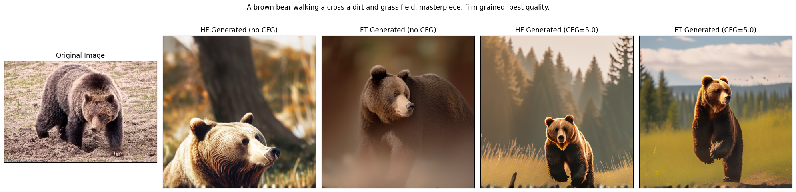
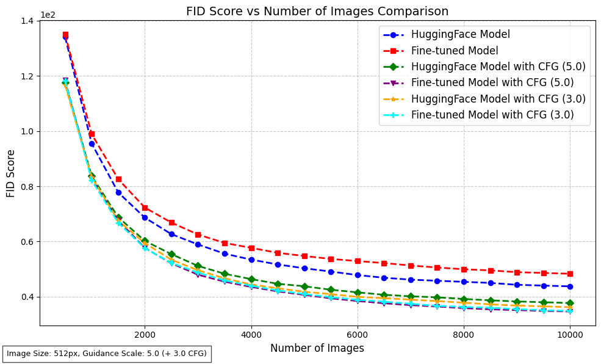

# Comparison of EMU3 Models on the Text-to-Image MSCOCO Benchmark

This repository contains the code for my project developed as part of the **Natural Language Processing** course exam at the **University of Trieste (UniTS)** for the academic year 2024–2025.

---

## Project Overview

This project investigates the performance of **Emu3** on the image generation task, comparing the **original `Emu3-Gen-hf` model** with a **fine-tuned version** adapted for *vision understanding*. The fine-tuned model was trained in the paper:

> *"The Narrow Gate: Localized Image-Text Communication in Vision-Language Models"* by Alessandro Serra et al. \[2]

The central research question addressed in this project is:

> **Does the image generation quality of Emu3-Gen decrease when the model is fine-tuned for vision understanding tasks?**

To answer this, I used a subset of the **MSCOCO** dataset to generate images with both the original and fine-tuned models. The results were evaluated using the **Fréchet Inception Distance (FID)** metric \[3], a standard metric for measuring the quality of generated images.

All experiments were run on an **NVIDIA A100 GPU** using the [Orfeo cluster](https://orfeo-doc.areasciencepark.it/). The code is structured to be easily reusable; users can adapt the file paths in the `code/` directory to run experiments in similar environments.

---

## Results

### Example Generated Images

Below are sample images generated by the models using prompts from the MSCOCO dataset:

### FID Scores

The chart below shows the FID scores computed for both models as the number of generated images increases. Lower FID indicates better image quality and greater similarity to real images:

**Presentation Slides**: 📑 [View Slides](https://docs.google.com/presentation/d/1qpJRKUeZMtBM81mmu5PsaGFME349ORBOHhuBfroazvw/edit?usp=sharing)

---

## References

\[1] X. Wang et al., *Emu3: Next-Token Prediction is All You Need*, arXiv preprint, arXiv:2409.18869, 2024. DOI: [10.48550/arXiv.2409.18869](https://doi.org/10.48550/arXiv.2409.18869)
[https://arxiv.org/abs/2409.18869](https://arxiv.org/abs/2409.18869)

\[2] A. Serra et al., *The Narrow Gate: Localized Image-Text Communication in Vision-Language Models*, arXiv preprint, arXiv:2412.06646, 2025.
[https://arxiv.org/abs/2412.06646](https://arxiv.org/abs/2412.06646)

\[3] M. Heusel, H. Ramsauer, T. Unterthiner, B. Nessler, and S. Hochreiter, *GANs Trained by a Two Time-Scale Update Rule Converge to a Local Nash Equilibrium*, arXiv preprint, arXiv:1706.08500, 2018. DOI: [10.48550/arXiv.1706.08500](https://doi.org/10.48550/arXiv.1706.08500)
[https://arxiv.org/abs/1706.08500](https://arxiv.org/abs/1706.08500)

### Additional Resources

* FID metric documentation: [TorchMetrics – FID](https://lightning.ai/docs/torchmetrics/stable/image/frechet_inception_distance.html)
* FID implementation: [https://github.com/mseitzer/pytorch-fid](https://github.com/mseitzer/pytorch-fid)
* Model repositories on Hugging Face:

  * [BAAI/Emu3-Gen-hf](https://huggingface.co/BAAI/Emu3-Gen-hf)
  * [BAAI/Emu3-Gen](https://huggingface.co/BAAI/Emu3-Gen)
  * [francescortu/Emu3-Gen-hf](https://huggingface.co/francescortu/Emu3-Gen-hf)
